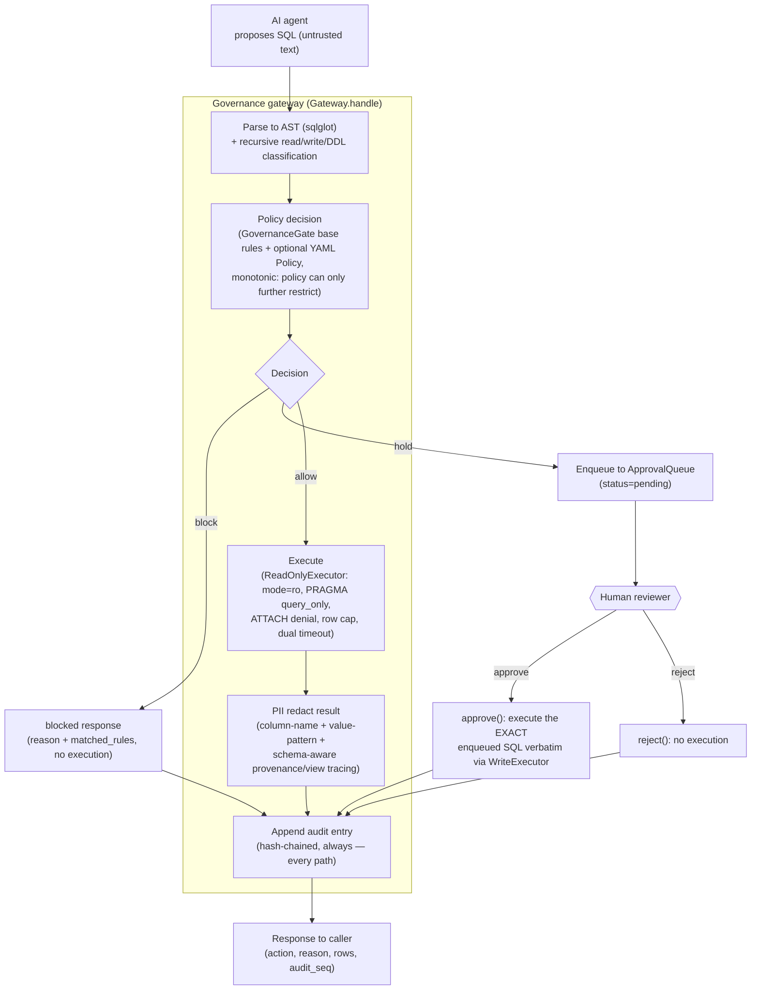

# IcBerg Architecture

IcBerg is a governance layer that sits between an AI agent and a database. An agent
never receives a raw database connection or credentials; it only ever *proposes* SQL
text. That proposal is parsed into an AST (`sqlglot`), recursively classified as
read/write/DDL (including statements hidden inside a CTE or subquery), and run through
a fail-safe, default-deny policy gate: destructive and out-of-scope operations are
blocked outright, mutations without a `WHERE` clause are blocked, mutations with a
`WHERE` clause are held for human approval, and bounded, scoped reads are allowed.
Anything allowed executes through an engine-level least-privilege, read-only path,
has PII redacted from the result, and — on every path, block/hold/allow alike — is
appended to a tamper-evident, hash-chained audit log before a response is returned.

## Request flow

The same sequence — decide, execute only if allowed, redact, always audit — is the one
path every integration surface routes through (`Gateway.handle`); no surface has a
side door that skips it.

## Components

| Module | Responsibility |
|---|---|
| `backend/core/sql_governance.py` | The policy decision gate (`GovernanceGate`). Parses proposed SQL with `sqlglot`, recursively classifies it read/write/DDL/unknown (including inner nodes of CTEs and subqueries), and applies fail-safe default-deny rules: block DDL and out-of-scope/destructive statements, block writes with no `WHERE`, hold writes with a `WHERE`, allow bounded reads. Detects dangerous functions (RCE/sequence-mutation/DoS primitives) via three independent layers: AST-based function-name resolution (primary), string-level regexes (secondary, catches patterns with no function-call AST hook), and raw-text decoding of Postgres Unicode-escaped identifiers (`U&"..."`, a bypass of the other two). |
| `backend/core/policy.py` | Optional per-deployment `Policy` (YAML/dict), applied immediately after the base gate's decision. Strictly monotonic — can deny/allow-list tables, force approval on writes, cap row counts, or add extra PII column keywords, but can never loosen a decision the base gate already made. |
| `backend/core/executor.py` | The trusted execution boundary (`ReadOnlyExecutor`, `PostgresReadOnlyExecutor`). Only ever touches a real database for a decision already marked `allow`. For SQLite, the read boundary is engine-level: the connection is opened `file:<path>?mode=ro`, enforced by the OS file descriptor itself, not just the mutable `PRAGMA query_only` session flag layered on top. A connection authorizer denies `ATTACH`/`DETACH DATABASE` independently of the policy gate's own rule for it. Every read is additionally bounded by a forced row cap and a dual-layer statement timeout (an in-process interrupt watchdog plus a hard fallback). |
| `backend/core/connectors.py` | `connector_for(dsn)` — a uniform `Connection` (read + write executor pair, plus best-effort schema introspection) regardless of backend. SQLite is fully wired and hardened; Postgres and MySQL reuse the same executor contract, with drivers imported lazily so their absence never breaks the SQLite-backed test suite. |
| `backend/core/redaction.py` | PII redaction on the `allow` path (`redact_rows`, `redact_text`) — the confidentiality control, not a replacement for database-level access control. Layers column-name classification (any column named `email`/`ssn`/`phone`/etc. is masked outright) with value-pattern scanning (catches PII in oddly-named or aggregated columns), plus schema-aware provenance tracing that resolves PII hidden behind a view or renamed column using a real schema catalog. |
| `backend/core/schema_catalog.py` | Live schema introspection (`SchemaCatalog`) — tables, columns, and view definitions — so `redaction.py`'s provenance layer can inline a view's real body and fully qualify `SELECT *`/ambiguous columns against the database's actual schema instead of the query text alone. |
| `backend/core/audit.py` | Tamper-evident, hash-chained audit log (`AuditLog`). Every decision — allow, block, or hold — is appended, never only the ones that executed. Each entry's hash covers every other field including the previous entry's hash; `verify()` walks the chain and reports the first broken link. Layered with append-only storage (DB triggers reject `UPDATE`/`DELETE`), an external anchor file for the chain head (detects a full self-consistent rewrite, not just a single edit), and PII-scrubbed `proposed_sql`/salted `result_hash` at rest. |
| `backend/core/approvals.py` | The human-in-the-loop approval queue (`ApprovalQueue`) that finally executes a `hold` decision. A held write is enqueued with the exact proposed SQL, immutably; `approve()` looks up and runs that exact stored SQL — never re-parsed or re-derived — closing replay/TOCTOU risk. The pending→decided transition is a single atomic conditional `UPDATE`, so two concurrent approve/reject calls on the same id can never both proceed; self-approval (`approver == actor`) is refused before the claim. |
| `backend/core/gateway.py` | The composition point (`Gateway.handle`). Fixed sequence for every proposal, regardless of outcome: evaluate (gate + optional policy) → execute-if-`allow` via the read-only executor → redact → append one audit entry, always. Refuses (raises) if handed anything not explicitly marked `IS_READONLY = True` — a wiring bug fails closed, not open. |
| `backend/gateway_app.py` | FastAPI application factory (`create_gateway_app(dsn)`). Composes a connector, `GovernanceGate`, `Gateway`, `AuditLog`, and `ApprovalQueue` into one self-contained governed-API instance per database — a factory call, not a module-level singleton, so multiple isolated instances can coexist. Separate from the project's original Titanic Q&A demo app (`backend/main.py`). |
| `backend/api/gateway_routes.py` | The REST + SSE surface: `POST /query` (propose → decide → execute-if-allowed → redact → audit), `POST /query/stream` (the same decision as SSE events), `GET /approvals` / `POST /approvals/{id}` (list/approve/reject), `GET /audit` (redacted trail + hash-chain verification), `GET /health`, `GET /metrics`. Per-actor rate limiting; every error/response string is PII-scrubbed before it leaves this module. |
| `icberg/` (SDK) | The public, pip-installable `icberg` package — `govern()` (one-shot), `governed_connection()` / `GovernedConnection` (a reusable, stateful handle). Routes through the same `Gateway`/`GovernanceGate` pair as every other surface; deliberately never exposes a raw executor or database connection. |
| `backend/mcp_server.py` | MCP server (`create_mcp_server(dsn)`) exposing `query`, `list_pending_approvals`, `approve`, and `audit_tail` as governed MCP tools — thin wrappers over the same `GovernedConnection` the SDK uses, so an MCP-capable agent (Claude Desktop, Cursor, a custom client) gets governed DB access instead of raw credentials. |
| `backend/integrations/langgraph_tool.py` (in progress) | A drop-in LangChain/LangGraph `GovernedSQLTool` — swaps a raw SQL tool for a governed one in an agent graph, routing through the same `Gateway`/`GovernanceGate` pair as every other surface. Ships with a reference LangGraph agent that dogfoods the gateway end to end. |

## Defense-in-depth layering

No single control in IcBerg is trusted alone; each is backed by at least one
independent layer beneath it:

- **Dangerous-SQL detection**: AST-based function-name resolution (primary) +
  string-level regexes (secondary, catches patterns with no function-call AST node) +
  raw-text Unicode-escape decoding (a documented bypass of the first two, handled
  separately at the text level).
- **Read-only execution boundary**: an OS-level, file-descriptor read-only open
  (`mode=ro` on SQLite) as the real boundary, plus the mutable `PRAGMA query_only`
  session flag as a secondary layer, plus a connection authorizer that independently
  denies `ATTACH`/`DETACH DATABASE` regardless of what the policy gate decided.
- **Resource limits**: a forced row cap and a dual-layer statement timeout (an
  in-process interrupt watchdog plus a hard fallback), applied to every read
  independent of whatever `LIMIT` the proposed SQL does or doesn't contain.
- **PII redaction**: column-name classification + value-pattern scanning + schema-aware
  provenance/lineage tracing through views and renamed columns — three layers so a
  PII column has to evade all three (by name, by value shape, and by lineage) to leak.
- **Audit integrity**: a hash chain over every entry, append-only storage enforced by
  database triggers, and an external anchor file for the chain head — so even a fully
  self-consistent rewrite of the stored chain is still detectable against the anchor.
- **Approval workflow**: verbatim re-execution of exactly the SQL a human reviewed
  (never re-parsed), an atomic claim on the pending→decided transition, and an explicit
  self-approval refusal.
- **Policy layer**: a YAML `Policy` can only ever further restrict the base gate's
  decision (deny-list a table, force approval, cap rows) — never loosen it.

## Integration surfaces

IcBerg is designed to be reached four ways, all funneling through the identical
`Gateway.handle` decision path:

1. **Python SDK** (`icberg/`) — `pip install icberg`; wrap database access in-process
   via `govern()` or a `governed_connection()` handle, for Python agent stacks.
2. **Docker service** (`backend/gateway_app.py`, `backend/Dockerfile`,
   `docker-compose.yml`) — a self-hostable REST + SSE API in front of a governed
   database, with no change to the database itself.
3. **MCP server** (`backend/mcp_server.py`) — `query` / `list_pending_approvals` /
   `approve` / `audit_tail` as governed MCP tools for any MCP-capable agent (Claude
   Desktop, Cursor, a custom client), so the agent gets governed DB tools instead of
   raw credentials.
4. **LangChain/LangGraph tool** (`backend/integrations/langgraph_tool.py`, in
   progress) — a drop-in `GovernedSQLTool` that swaps a raw SQL tool for a governed
   one in an existing agent graph.

## Security posture & residual risks

- **Defense-in-depth by design, not a single choke point.** Every control above
  (dangerous-function detection, the read-only boundary, PII redaction, audit
  integrity, the approval workflow) is deliberately layered so that a bypass of any
  one layer alone does not defeat the control — see `THREAT_MODEL.md` for the full,
  per-control breakdown and the specific bypasses each additional layer was added to
  close.
- **Least-privilege database GRANTs are the authoritative PII control, not
  redaction.** `redaction.py`'s name/value/provenance layers are a safety net over an
  `allow` result — they are name/pattern-based and not exhaustive. The control a
  production deployment must actually rely on is a read-only database role, connected
  through by the gateway, that has no `SELECT` grant on PII columns in the first
  place. Redaction catches what that role is still granted; it does not substitute
  for scoping the grant correctly.
- **No built-in authentication or identity provider yet.** `actor` (on proposing a
  query) and `approver` (on deciding a held one) are self-asserted strings, not
  verified identities. Self-approval (`approver == actor`) is refused as an in-process
  stopgap, but a different claimed identity is not distinguishable from a real one.
  `POST /approvals/{id}` and the other mutating endpoints must sit behind real
  authentication and authorization before being exposed beyond a trusted internal
  network. Per-actor rate limiting exists as a UX throttle against runaway traffic; it
  is explicitly not a security control while `actor` is unauthenticated.
- **SQLite has the fully-hardened read-only boundary; Postgres/MySQL do not (yet).**
  SQLite's `mode=ro` is an OS-enforced, non-negotiable boundary. Postgres and MySQL
  currently rely on session-level read-only settings (e.g.
  `SET SESSION TRANSACTION READ ONLY`), which are mutable session state, not an
  engine-enforced boundary — for those backends, a least-privilege connecting role is
  not a defense-in-depth nicety but the primary control.
- **The `hold` → approval path is real but still lightly exercised in production
  terms.** The queue guarantees verbatim, atomic, non-replayable execution of an
  approved statement, but everything upstream of "a human clicked approve" (who that
  human is, what channel they reviewed the SQL through) is outside this system's
  current scope.

See `THREAT_MODEL.md` for the complete threat catalog, per-phase residual-risk
sections, and the reasoning behind each layering decision summarized above.
